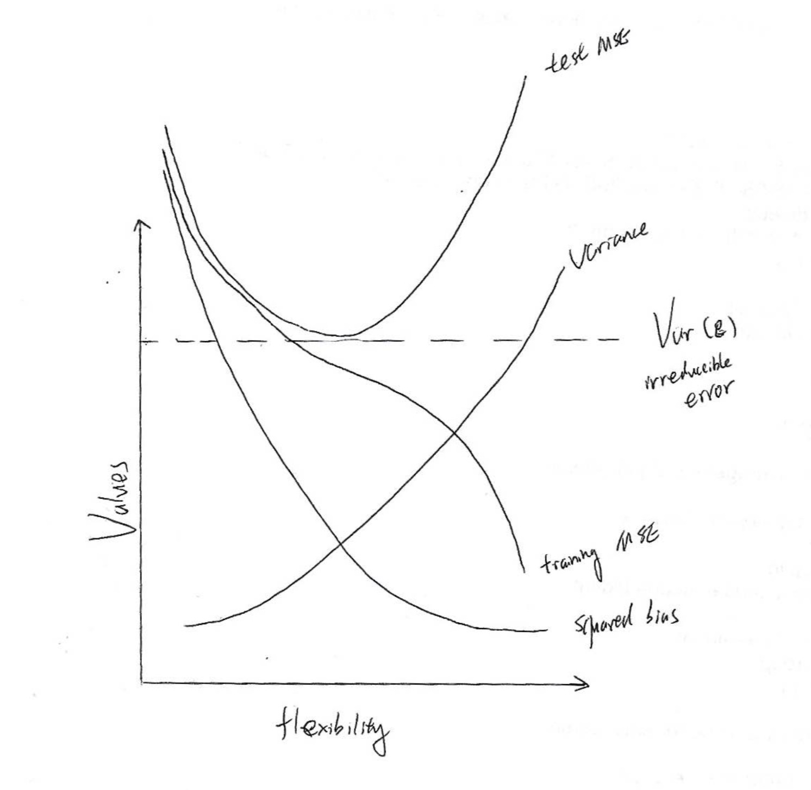
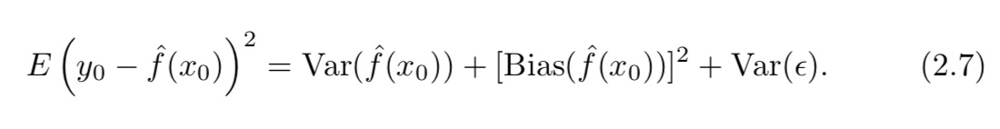
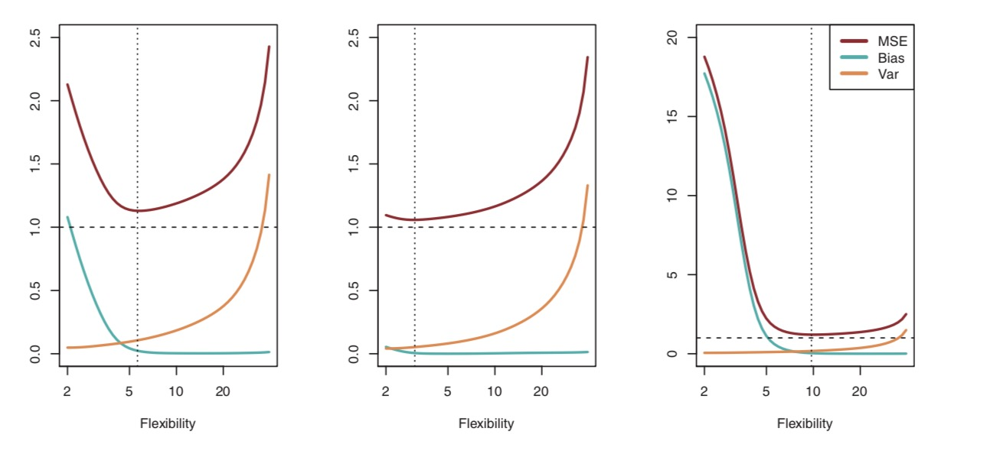

```{r setup, include=FALSE}
knitr::opts_chunk$set(echo = TRUE)
```

## Question 1 

Flexible method vs. inflexible methods

- (a) The extremely large sample reduce the risk of over-fitting, so the flexible method would perform better.
- (b) The small sample size increase the risk of over-fitting, so the inflexible method would perform better. 
- (c) Inflexible methods are not good at dealing with non-linear problem, so the flexible method would be better.
- (d) The high variance of error indicating potential over-fitting problems, so inflexible method would be better. 

## Question 3 

(a)The sketch of typical (squared) bias, variance, training error, test error, and Bayes (or irreducible) error curves.



(b) Explanation:



Because the expected test MSE can never lie below Var(ε), the irreducible error from, so the irreducible error is a constant line below the test MSE curvve. 
As a general rule, as we use more flexible methods, the variance will increase and the bias will decrease. The training MSE declines monotonically as flexibility increases.  
However, at some point increasing flexibility has little impact on the bias but starts to significantly increase the variance. When this happens the test MSE increases.As a general rule, as we use more flexible methods, the variance will increase and the bias will decrease.The squared bias decreases monotonically and the variance increases monotonically.




## Question 8

```{r}
library(ISLR)
data(College)
college <- read.csv("College.csv")
```

```{r}
rownames(college)=college[,1] 
college=college[,-1]
head(college[,1:5])
```

```{r}
summary(college)
```

```{r}
pairs(college[,1:10])
```
```{r}
plot(college$Private, college$Outstate, 
     xlab = "Private University", 
     ylab ="Out of State tuition in USD", 
     main = "Outstate Tuition Plot")
```

```{r}
Elite <- rep("No", nrow(college))
Elite[college$Top10perc > 50] <- "Yes"
Elite <- as.factor(Elite)
college$Elite <- Elite
summary(college$Elite)
```

```{r}
plot(college$Elite, college$Outstate, 
     xlab = "Elite University", 
     ylab ="Out of State tuition in USD", 
     main = "Outstate Tuition Plot")
```

```{r}
par(mfrow = c(2,2))
hist(college$Books, col = 2, xlab = "Books", ylab = "Count")
hist(college$PhD, col = 3, xlab = "PhD", ylab = "Count")
hist(college$Grad.Rate, col = 4, xlab = "Grad Rate", ylab = "Count")
hist(college$perc.alumni, col = 6, xlab = "% alumni", ylab = "Count")
```

```{r}
summary(college$Grad.Rate)
```
It is weird to have a university with only 10% graduation rate. 
```{r}
grad<- college[college$Grad.Rate == 10, ]
grad
```


It looks like Texas Southern University is the university with only 10% graduation rate. 
